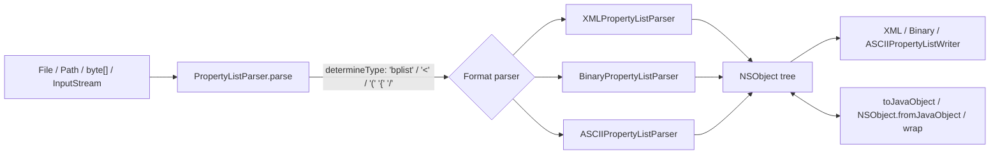

# Repository Guidelines

## Project Overview
dd-plist (`com.googlecode.plist:dd-plist`) is an MIT-licensed Java library that reads, writes, and converts Apple/NeXTSTEP/GNUstep property lists. It supports XML, binary (`bplist00`), and ASCII/GNUstep ASCII. It does **not** support NSKeyedArchiver semantics. Only the 1.x line is maintained, so keep the public API backward compatible.

## Architecture & Data Flow
Everything lives in a single flat package: `src/main/java/com/dd/plist` (no subpackages).



- **Model:** `NSObject` is the abstract base (`Cloneable`, `Comparable`). Its subclasses are `NSDictionary`, `NSArray`, `NSSet`, `NSString`, `NSNumber`, `NSDate`, `NSData`, `NSNull`, and `UID`.
- **Facade:** `PropertyListParser` handles format sniffing and dispatches to the right parser. Its `saveAs*` and `convertTo*` helpers delegate to the `*PropertyListWriter.write(...)` methods, and the `saveAs*` methods are deprecated.
- **Java bridge:** `NSObject.toJavaObject()` / `toJavaObject(Class<T>)` converts to Java objects and POJOs through reflection, using the `PropertyListConverter` helpers. Going the other way uses `NSObject.fromJavaObject` / `wrap`.
- **Diagnostics:** `LocationInformation` and its `XML`/`Binary`/`ASCII` subclasses, plus `ParsedObjectStack`, record where each node came from so errors can report it. The XML parser only tracks line numbers when you pass `withLineInformation`.
- **Support:** `Base64` (custom codec for NSData), plus `ByteOrderMarkReader` / `ByteOrderMarkFilterInputStream` for BOM handling in text formats.

## Key Directories
| Path | Purpose |
|---|---|
| `src/main/java/com/dd/plist/` | All library code |
| `src/main/assembly/` | Assembly descriptors for the bin, javadoc, and sources zips |
| `src/test/java/com/dd/plist/test/` | JUnit 5 tests |
| `src/test/java/com/dd/plist/test/model/` | POJO fixtures for (de)serialization and clone tests |
| `test-files/` | Plist fixtures used by the tests |
| `.github/workflows/` | `build.yml` (CI), `javadoc.yml` (publishes to GitHub Pages when a `v#.#.#` tag is pushed) |

## Development Commands
```sh
mvn spotless:check            # format gate (CI runs this first)
mvn spotless:apply            # auto-format (Google Java Format)
mvn -DskipTests clean compile
mvn test
mvn test -Dtest=IssueTest#testIssue51_BillionLaughsAttack   # one test class or method
mvn package -DskipTests       # → target/dd-plist.jar, target/dd-plist-bin.zip
mvn javadoc:javadoc           # → target/reports/apidocs
```
- The final jar name has no version suffix (`target/dd-plist.jar`).
- `verify` runs both the spotless check and `maven-gpg-plugin` signing. Without a GPG key, stop at `package`.

## Code Conventions & Common Patterns
- **Formatting:** Spotless enforces Google Java Format with 2-space indent, max line length 100, LF line endings, UTF-8, and no unused imports (see `.editorconfig` and `.gitattributes`). Run `mvn spotless:apply` before committing.
- **Language level:** `maven.compiler.release=8`. Don't use any API newer than Java 8, even though CI builds on JDK 21.
- **Headers/docs:** every source file begins with the MIT license block (© Daniel Dreibrodt), followed by `package com.dd.plist;`. Public types carry full Javadoc (`@param`/`@return`/`@throws`) and `@author`.
- **Utility classes** are `final` and have a private constructor whose body is `/* empty */` (see `PropertyListParser`, `PropertyListConverter`).
- **Errors:** use checked exceptions declared in signatures, and don't wrap them in runtime exceptions.
  - `PropertyListFormatException` (the only custom exception, which carries a `LocationInformation`) is for structural or semantic plist errors.
  - ASCII syntax errors use `java.text.ParseException`.
  - XML parser errors pass through as `SAXException` / `ParserConfigurationException`.
  - I/O problems throw `IOException`.
- **Nulls:** never store a Java `null` in the tree. Use `NSNull.wrap(...)` / `NSNull.NULL` instead.
- **Security invariants (keep these intact):**
  - `XMLPropertyListParser` hardens its static `DocumentBuilderFactory` against XXE: no external entities or DTDs, no XInclude, no entity expansion.
  - The `SAXParserFactory` used on the line-tracking path is hardened separately. Any new XML parsing path needs both hardening blocks.
  - Nesting is capped at `MAX_NESTING_DEPTH = 512` in both the XML and binary parsers.
  - The binary parser validates lengths, offsets, the offset table, and object references; see CHANGELOG 1.30.0.
- **No `module-info.java`** in `src/main`. The `moditect-maven-plugin` injects module `com.dd.plist` at package time, and `maven-bundle-plugin` generates the OSGi manifest.

## Important Files
- `src/main/java/com/dd/plist/PropertyListParser.java` is the public entry point.
- `src/main/java/com/dd/plist/NSObject.java` is the model root and the Java conversion point.
- The `src/main/java/com/dd/plist/{XML,Binary,ASCII}PropertyList{Parser,Writer}.java` files handle the individual formats.
- `pom.xml` configures the plugins: spotless, javadoc, assembly, gpg, bundle, moditect, and Sonatype Central publishing.
- `README.md` shows the latest **released** version, not the one in development (`pom.xml`). It's expected to lag behind `pom.xml`; don't bump it during development.
- `CHANGELOG.md` follows Keep a Changelog: add entries under `## [Unreleased]` in `### Added/Changed/Fixed/Security` as plain prose bullets.
- `SECURITY.md` and `KEYS` cover private vulnerability reporting and the GPG release-signing keys.

## Runtime/Tooling Preferences
- Use Maven only; the repo has no shell or Python scripts.
- CI runs in the `maven:3.9-eclipse-temurin-21` container on a single JDK, with no test matrix.
- Test dependencies are `junit-jupiter` and `hamcrest`. The library itself has no runtime dependencies beyond `java.xml`, so don't add any.

## Testing & QA
- **Framework:** JUnit 5 (`org.junit.jupiter.api.Assertions`) with Hamcrest.
- **Test classes:** use `<Feature>Test` for each format or class (e.g. `BinaryPropertyListParserTest`, `NSNumberTest`).
  - Regression tests go in `IssueTest` (GitHub issues) or `GoogleCodeIssueTest` (legacy Google Code tracker).
  - Name regression methods `testIssueNN_ShortDescription`, e.g. `testIssue42_OutOfMemoryErrorWhenBinaryPropertyListTrailerIsCorrupt`.
- **Fixtures** are loaded with `new File("test-files/...")`, so the working directory must be the repo root (Maven's default, but set it explicitly in an IDE).
  - Name fixtures for new GitHub issues `github-issueNN.plist`. For variants use `github-issueNN-xml.plist` or `github-issueNN-1.plist`. For repros that need several files, use a `github-issueNN/` directory.
  - Format coverage files use names like `test1-ascii.plist`, `test1-binary.plist`, `test-xml-utf-16be-bom.plist`.
- **Generated outputs:** `test-files/out-*.plist` are written by round-trip tests and gitignored. Never edit or commit them.
- **Surefire setting:** Surefire sets `jdk.xml.maxElementDepth=50002` so that the library's own depth limit is what deep-nesting tests hit. Keep this setting.
- **Security fixes:** hostile-input fixes (billion laughs, corrupt binary trailers, deep nesting) each need a regression test plus a fixture. There's no fuzzing harness and no coverage threshold.
